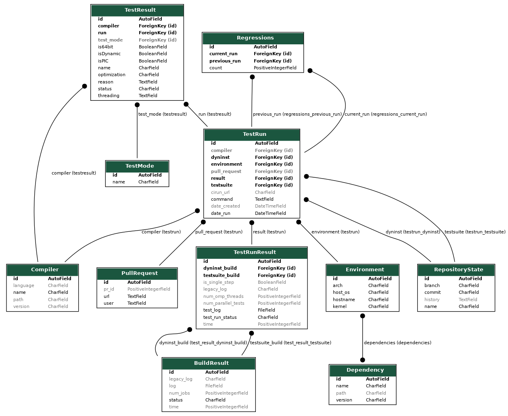

# Dyninst Dashboard

This dashboard shows Dyninst Testsuite results. 

## Usage

### 1. Install

You'll need to create a virtual environment and install dependencies there:

```bash
$ python -m venv env
$ source env/bin/activate
$ pip install -e .
```

Note that the above does a local, development install. It is setup as a Python package to make
this easy, but is not intended to be installed to system python as it relies on [manage.py] and
other assets to run.

### 2. Development

If you want to run a development server, you should first make migrations:

```bash
$ python manage.py collectstatic
$ python manage.py makemigrations main
$ python manage.py makemigrations users
$ python manage.py migrate

$ python manage.py runserver
Performing system checks...

System check identified no issues (0 silenced).
January 15, 2022 - 19:03:26
Django version 4.0.1, using settings 'ddash.settings'
Starting development server at http://127.0.0.1:8000/
Quit the server with CONTROL-C.
```

This means that the application is running on port 8000. You can adjust this:

```bash
$ python manage.py runserver 127.0.0.1:5000
```

## Development 

These are development notes. @hainest and @vsoch design discussion is in [docs/models.md](docs/models.md)
The current tables look like:

```bash
$ python manage.py graph_models main -o tables.png
```



## Refactor

To refactor, we need to still be able to support running in the current place of deployment.
This likely means we won't have access to containers, and so we will use a virtual environment
and start with sqlite.

### Technology to try

 - Django
 - virtual environment setup
 - sqlite
 - Python 3.6x

We only really need to keep results from December 2021 forward. 
Token on the command line.

### Discussion and Questions 

 - Does the server allow containers?
 - Data format for new logs?
 - Front end UI
 - Search Feature (across fields)
 - Collaborator Account?
 
### TODO

 - add front end view for search
 - add token auth 
 - add docs for all endpoints etc. 

## License

 * Free software: Apache License 2.0 or MIT.
